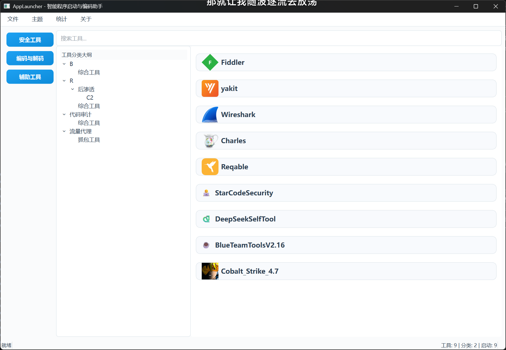
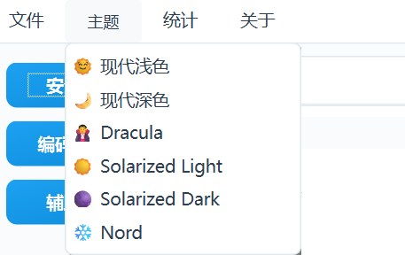

# AppLauncher - 智能程序启动与编码助手




AppLauncher 是一款为安全工程师、开发人员和极客爱好者量身打造的现代化桌面工具启动器。它通过强大而美观的界面，帮助您优雅地管理和启动所有本地应用、脚本和网页链接，并集成了多款实用的辅助工具。

---

## ✨ 核心功能

- **现代化UI界面**
  - **优雅设计**：简洁、美观的界面布局，支持流畅的交互体验。
  - **多主题支持**：内置多款精心设计的现代化主题（如 `Dracula`, `Solarized`, `Nord` 等），一键切换，满足您的个性化偏好。
  - **高度可定制的对话框**：所有核心功能窗口（如添加工具、统计、关于）均采用无边框、可拖拽的现代化设计。

- **强大的工具管理**
  - **无限级分类**：通过 `/` 分隔符创建无限层级的树形目录大纲，实现对工具的精细化管理（例如 `红队/后渗透/C2`）。
  - **丰富的工具类型支持**：完美支持 `GUI应用(.exe)`, `命令行`, `Java` (图形化/命令行), `Python`, `PowerShell`, `批处理`, `网页链接`, `文件夹` 等多种类型。
  - **智能启动**：自动设置正确的启动环境（如工作目录），确保脚本和带有相对路径参数的工具能够正常运行。

- **实用的集成工具**
  - **CyberChef**: 本地集成了强大的编解码工具集 CyberChef，无需联网即可使用。
  - **反弹Shell生成器**: 内置反弹Shell命令生成页面，方便快速生成各种类型的Shell。
  - **Java命令编码**: 集成Java exec命令编码工具，助力漏洞利用。

- **数据驱动的洞察**
  - **统计面板**: 提供一个现代化的统计仪表盘，可视化展示工具总数、使用频率、分类统计等信息。
  - **最近使用**: 自动记录并展示最近使用的工具，方便快速再次启动。

- **高效的操作体验**
  - **快速搜索**: 即时搜索工具名称、描述和分类。
  - **快捷键支持**: 支持 `Ctrl+F` 搜索, `F5` 刷新, `F11` 全屏等多种快捷键。
  - **配置导入/导出**: 方便地通过 `JSON` 文件备份、迁移和分享您的工具库配置。

---

## 🚀 快速开始

### 环境要求
- **操作系统**: Windows 10 / 11
- **Python**: Python 3.8 或更高版本

### 安装与运行
1.  克隆或下载本项目到本地：
    ```bash
    git clone https://github.com/z50n6/app-launcher.git
    cd app-launcher
    ```

2.  安装项目依赖：
    ```bash
    pip install -r requirements.txt
    ```

3.  运行启动器：
    ```bash
    python launcher.py
    ```
    或者，您也可以直接双击 `启动器.bat` 文件来快速启动。

---

## 📖 使用指南

### 1. 添加与管理工具
- **添加**: 在主界面工具列表的空白处右击，选择"新增工具"，或通过菜单栏"文件"->"添加工具"打开对话框。
- **编辑/删除**: 在工具上右击，即可选择编辑或删除。

### 2. 创建多级分类
- 在"添加/编辑工具"对话框的"工具分类"字段中，使用正斜杠 `/` 作为分隔符即可创建多级分类。
- **示例**:
  - `代码审计/静态分析` 将创建一个两级分类。
  - `渗透测试/Web安全/扫描器` 将创建一个三级分类。
- 程序将自动根据您填写的路径生成对应的树形大纲。

### 3. 切换主题
- 点击菜单栏的"主题"选项。
- 从下拉列表中选择您喜欢的主题，程序将立即应用新的外观。



### 4. 查看统计
- 点击菜单栏的"统计"->"总工具数"，即可打开现代化的统计面板。
- 点击菜单栏的"统计"->"最近启动的工具"，查看您最近的操作历史。


---

## 常见问题 (FAQ)

**Q: 我可以手动编辑配置文件吗?**  
A: 可以。您可以直接编辑项目根目录下的 `config.json` 文件。程序会在下次启动时加载您的修改。为了数据安全，建议修改前先进行备份。

**Q: 为什么我的Java命令行工具启动失败？**  
A: 我们已经优化了启动逻辑。请确保您的Java工具类型选择了 `java8` 或 `java11`（而不是 `java8图形化`）。在"启动参数"字段中，您现在可以填写 `java` 命令之后的所有内容，例如 `-javaagent:agent.jar -jar mytool.jar`。程序会自动设置工具所在目录为工作目录。

---

## 协议

本项目基于 [MIT License](./LICENSE) 开源。

## 致谢
- [PyQt6](https://www.riverbankcomputing.com/software/pyqt/)
- [CyberChef](https://github.com/gchq/CyberChef)
- [revshells.com](https://www.revshells.com/)