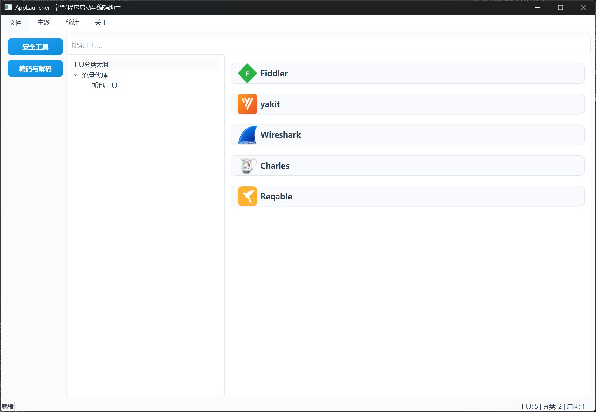
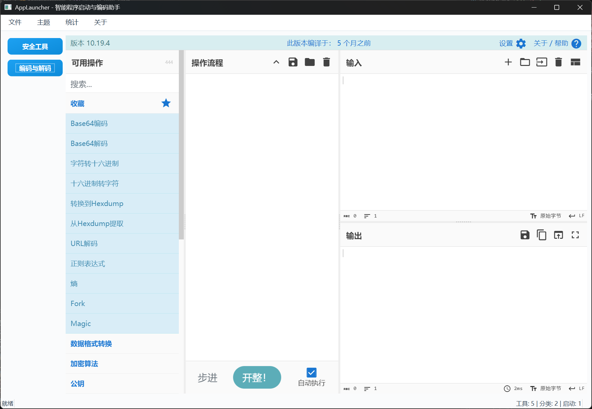

# AppLauncher 智能程序启动与编码助手

## 项目简介
AppLauncher 是一款现代化的安全工具与编码解码启动管理器，支持树形大纲分类、图标美观展示、极简导航与高效操作。适合渗透测试、信息安全、开发等多场景工具管理。它不仅是一个工具启动器，更是一个强大的工具管理平台。

## 主要功能

### 工具管理
- **树形大纲分类**：支持一级和二级分类的自定义组织，自动生成目录大纲
- **工具美观展示**：
  - 支持自定义图标或类型emoji
  - 工具名称加粗显示
  - 显示工具类型、启动次数等信息
  - 支持工具描述和启动参数
- **丰富的操作菜单**：
  - 编辑工具信息
  - 删除工具
  - 打开工具所在文件夹
  - 打开命令行
  - 双击快速启动
  - 空白处右键新增工具

### 界面与交互
- **现代化界面**：
  - 简洁优雅的设计风格
  - 自适应布局
  - 支持现代浅色/深色主题切换
  - 弹窗与主界面风格统一
- **高效导航**：
  - 左侧固定分类导航
  - 快速分类切换
  - 工具搜索功能
  - 最近使用记录

**截图：**





### 数据管理
- **配置文件管理**：
  - 支持直接编辑config.json文件
  - 自动同步配置更改
  - 配置文件备份和恢复
- **导入导出**：
  - 一键导入/导出所有工具及分类
  - JSON格式，方便迁移和共享
  - 支持批量导入工具

### 编码工具集成
- **CyberChef 集成**：
  - 内置本地版CyberChef
  - 支持自动切换在线版
  - 满足多种编码转换需求

## 快速开始

### 环境要求
- Python 3.8 及以上
- Windows 10/11 操作系统
- 2GB及以上可用内存
- 500MB及以上可用磁盘空间

### 安装步骤
1. 克隆或下载项目：
   ```bash
   git clone https://github.com/z50n6/app-launcher.git
   cd app-launcher
   ```

2. 安装依赖：
   ```bash
   pip install -r requirements.txt
   ```

3. 运行程序：
   ```bash
   python launcher.py
   ```
   或直接双击`启动器.bat`/`启动器.vbs`

### 依赖包列表
- PyQt6：GUI框架
- PyQt6-WebEngine：网页渲染支持
- 其他依赖见requirements.txt

## 使用指南

### 添加工具
1. 右键空白处或点击"文件->添加工具"
2. 填写工具信息：
   - 名称：工具显示名称
   - 路径：可执行文件路径
   - 分类：选择或新建分类
   - 类型：选择工具类型
   - 描述：工具说明（可选）
   - 图标：自定义图标（可选）
   - 启动参数：命令行参数（可选）

### 管理分类
- 支持添加、重命名、删除分类
- 可以创建二级子分类
- 拖拽工具到不同分类
- 分类支持展开/折叠

### 配置管理
- 配置文件位置：程序目录下的config.json
- 支持手动编辑配置文件
- 修改配置后自动同步到程序
- 定期备份配置文件建议

### 快捷键
- Ctrl+N：添加新工具
- Ctrl+E：导出配置
- Ctrl+I：导入配置
- Ctrl+Q：退出程序

## 常见问题

### 配置文件相关
Q: 如何备份我的工具配置？  
A: 可以直接复制config.json文件，或使用程序的导出功能。

Q: 可以手动编辑配置文件吗？  
A: 可以，程序支持直接编辑config.json文件，重启后生效。

### 工具管理相关
Q: 支持哪些类型的工具？  
A: 支持GUI应用、命令行工具、Java程序、Python脚本、网页等多种类型。

Q: 如何修改工具启动参数？  
A: 编辑工具信息时可以在"启动参数"栏填写。


## 作者与协议
- 作者：z50n6  [GitHub](https://github.com/z50n6)
- 开源协议：MIT License

## 致谢
感谢以下开源项目：
- [PyQt6](https://www.riverbankcomputing.com/software/pyqt/)
- [CyberChef](https://github.com/gchq/CyberChef) 
- [SRK-Toolbox](https://github.com/Raka-loah/SRK-Toolbox)