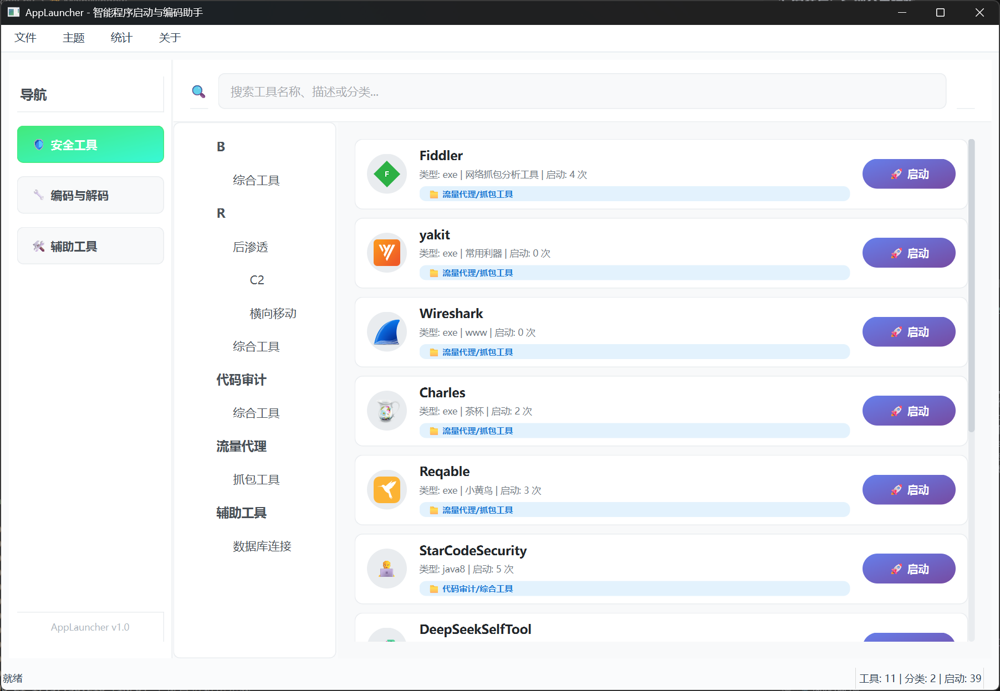
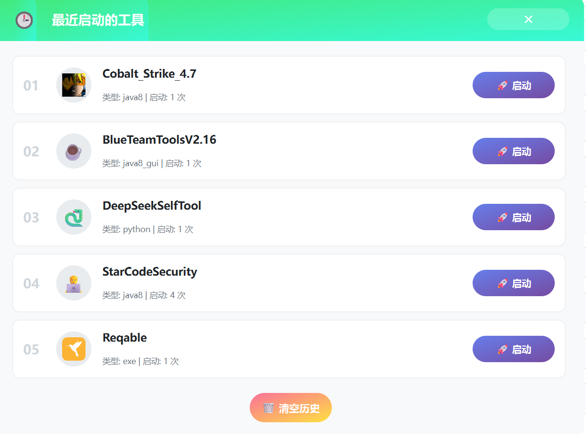

# AppLauncher - 智能程序启动与编码助手 🚀

> 一站式本地工具管理、分类、启动与辅助脚本平台，专为安全工程师、开发者和极客设计。


---

## ✨ 主要特性

- **现代化UI**：多主题、无边框、可拖拽窗口，极致美观
- **无限级分类**：树形大纲，支持多层级工具组织
- **多类型支持**：EXE、命令行、Java、Python、PowerShell、网页、文件夹等
- **智能启动**：自动设置工作目录，支持参数传递
- **集成辅助工具**：本地CyberChef、反弹Shell生成、Java命令编码等
- **数据统计**：可视化统计面板、最近使用历史
- **高效操作**：即时搜索、丰富快捷键、配置导入导出

---

## 🚀 快速开始

### 环境要求
- **操作系统**：Windows 10/11
- **Python**：3.8 及以上

### 安装与运行

```bash
git clone https://github.com/z50n6/app-launcher.git
cd app-launcher
pip install -r requirements.txt
python launcher.py
```
或直接双击 `启动器.bat` 一键启动。

---

## 📖 使用指南

- **添加工具**：主界面空白处右键，或菜单栏"文件"→"添加工具"
- **多级分类**：分类字段用 `/` 分隔，如 `红队/后渗透/C2`
- **切换主题**：菜单栏"主题"一键切换
- **统计面板**：菜单栏"统计"→"总工具数"/"最近启动的工具"
- **配置导入导出**：菜单栏"文件"→"导入/导出配置"

---

## 🖼️ 界面预览






---

## ❓ 常见问题

- **Q: 可以手动编辑 config.json 吗？**  
  A: 可以，建议备份后编辑，重启程序生效。

- **Q: Java工具如何正确启动？**  
  A: 工具类型选 `java8` 或 `java11`，参数栏填写完整命令参数，程序会自动设置工作目录。

---

## 📄 协议

本项目基于 [MIT License](./LICENSE) 开源。

## 🙏 致谢

- [PyQt6](https://www.riverbankcomputing.com/software/pyqt/)
- [CyberChef](https://github.com/gchq/CyberChef)
- [revshells.com](https://www.revshells.com/)

---

> 欢迎 Star、Fork、提 Issue 交流改进！